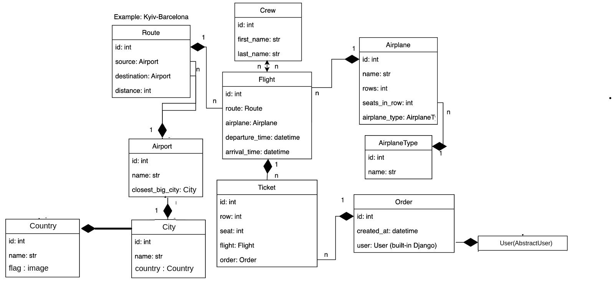

# Sky Air

Simple airport api ,
structured by city , country, airplane, airport , etc.

## Docker

[Top  movies  project  dockerised  to docker.hub](#)

## installation

Python3 must be already installed

```shell
git clone https://github.com/M4Xpy/sky_air
cd sky_air
python3 -m venv venv
source venv/bin/activate
pip install requirements.txt
python manage.py runserver # starts Django project
```

## Features

* Authentication functionality for Customer/User
* Managing by city , country, airplane, airport , etc. directly from api interface
* Admin panel for advanced managing

## Demo


## Scheme of models

